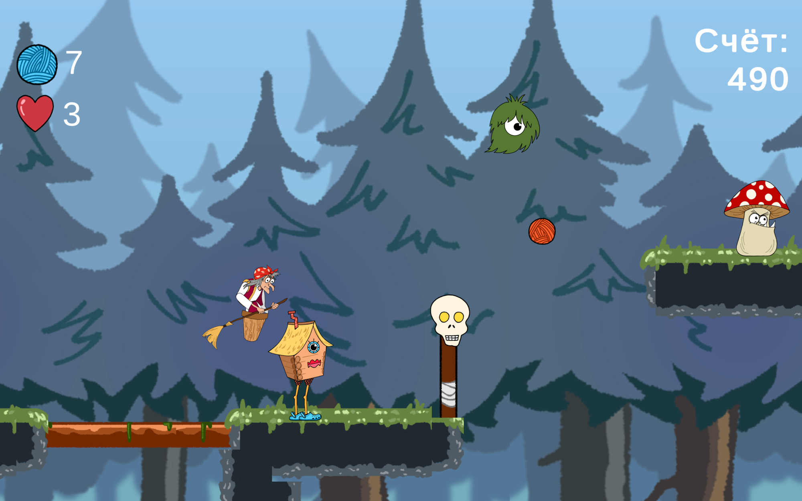

# 🏃‍♀️ Balls and Heels

[](https://github.com/Bit-Maximum/ASAP-Gaming-School/blob/master/README.md)
[](https://github.com/Bit-Maximum/ASAP-Gaming-School/blob/master/Translation/README.ru.md)

> *A fast-paced platformer steeped in Slavic folklore — where the Hut doesn’t sit still, it runs!*

## 🎮 About the Project

**«Balls and Heels»** is a **2D adventure platformer** set in the world of Slavic mythology, created during the **ASAP_GAMES_SCHOOL** game jam. The project was developed over the course of one week by our team "Chonky Rabbit":

- 👨‍💻 **Developer**: Maxim Merkurev
- 🎨 **Artist**: Polina Ivanashko
- 🧠 **Game Designer**: Pavel Lyutar

The game was presented at the final demo session and is available to play online.

🌐 **Play directly in your browser:**  
👉 [https://thethirdonetoldthetruth.itch.io/klubki-da-kabluki](https://thethirdonetoldthetruth.itch.io/klubki-da-kabluki)

https://github.com/user-attachments/assets/3f0dc83b-ba03-4c4e-95c3-c809140ed7bc

---

## 🧵 Story

The main heroine is the **Chicken-Legged Hut**, entrusted by Baba Yaga to guard magical yarn balls. But she lost them all…
Now she’s dashing through the forest, collecting the lost items and kicking away anything that gets in her path.
Before someone catches up… 👀

---

## 🦶 Features

- ⚡ Fast-paced **runner-style gameplay** with platforming mechanics
- 🧙‍♀️ Folklore-inspired visuals and humor
- 🥿 Magical shoes from Baba Yaga with different bonuses
- 🌲 Forest-themed obstacles and enemies
- 🎨 Original art and sound design
- 🌐 WebGL build — playable right in the browser

---

## 📸 Gallery


</img> </img> </img> </img>

---

## 🛠️ How to Run the Project Locally (Unity)

If you’d like to check out the project, build it, or make modifications — you can do so directly in the **[Unity](https://unity.com/ru/download)** editor.

### 🔧 Requirements

- [Unity Editor](https://unity.com/ru/releases/editor/whats-new/2022.3.48#installs) (рекомендуемая версия — `2022.3.48f1 LTS`)

### 📥 Steps:

1. **Clone the repository** (or download the ZIP):
```bash
git clone https://github.com/Bit-Maximum/ASAP-Gaming-School.git
```

2. Open Unity Hub. Click "Add project" and select the project folder.

3. Open the scene titled "Tutorial" (or any other you prefer).

4. Press `▶ Play` in the Unity editor.

## 👨‍💻 My Role

- Unity project implementation
- Character logic, bonuses, and collisions programming
- WebGL build adaptation
- Final build and presentation
- Browser version + local builds

---

## 📜 Certificate

🪪 Project participation confirmed by a certificate from **ASAP_GAMES_SCHOOL**.  


> _Thanks to the ASAP_GAMES_SCHOOL team for organizing the jam!_
