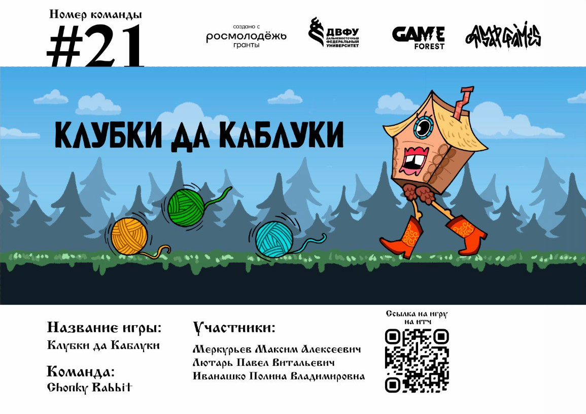
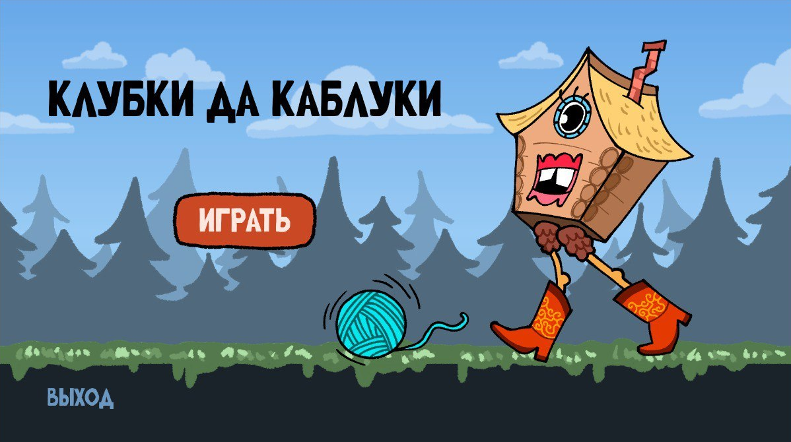
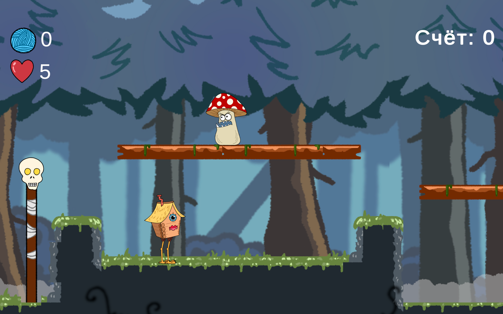
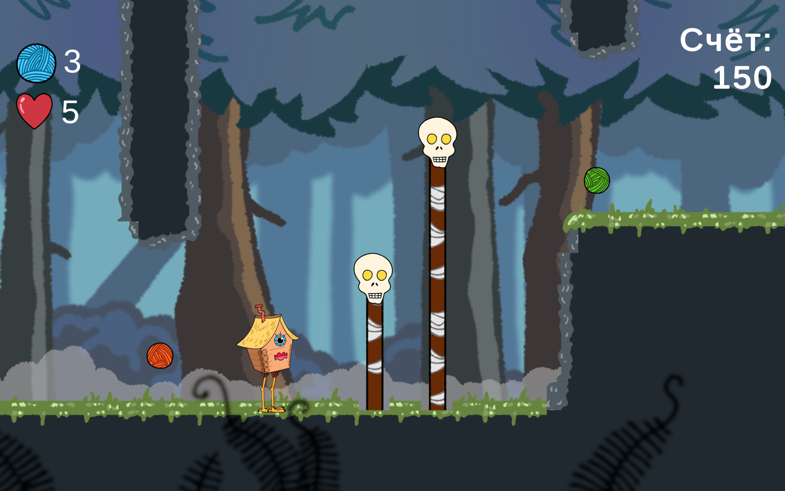
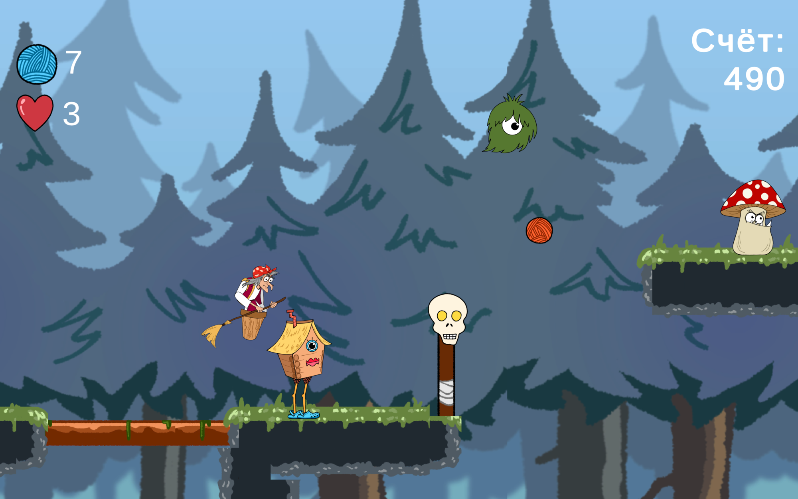
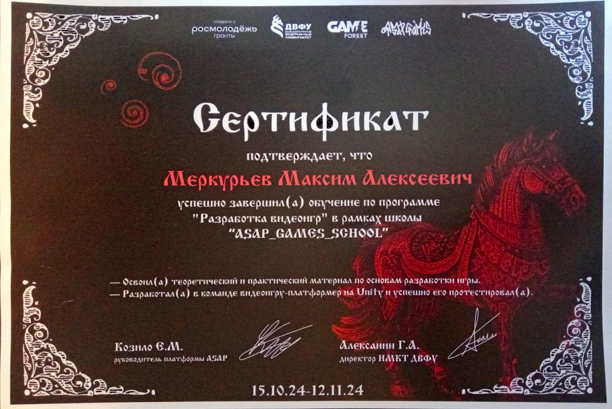

# 🏃‍♀️ Клубки да Каблуки

[](https://github.com/Bit-Maximum/ASAP-Gaming-School/blob/master/README.md)
[](https://github.com/Bit-Maximum/ASAP-Gaming-School/blob/master/Translation/README.ru.md)

> *Скоростной платформер в духе славянского фольклора — где Избушка не сидит, а несётся!*

## 🎮 О проекте

**«Клубки да Каблуки»** — это **приключенческий 2D-платформер** в сеттинге славянского фольклора, созданный в рамках геймджема **ASAP_GAMES_SCHOOL**. Проект был разработан за одну неделю нашей командой "Chonky Rabbit":

- 👨‍💻 **Разработчик**: Максим Меркурьев
- 🎨 **Художник**: Полина Иванашко
- 🧠 **Геймдизайнер**: Павел Лютарь

Игра была представлена на итоговой презентации участников и доступна онлайн.

🌐 **Играть прямо в браузере:**  
👉 [https://thethirdonetoldthetruth.itch.io/klubki-da-kabluki](https://thethirdonetoldthetruth.itch.io/klubki-da-kabluki)

---

## 🧵 Сюжет

Главная героиня — **Избушка на курьих ножках**, которой Баба Яга доверила охранять волшебные клубки. Но Избушка всё потеряла… и теперь, не мешкая, мчится через лес, подбирая утерянное и распинывая всё, что встаёт на пути.  
Пока не догнали… 👀

---

## 🦶 Особенности

- ⚡ Безумный **скоростной геймплей** с элементами раннера и платформера
- 🧙‍♀️ Фольклорная стилистика и юмор
- 🥿 Магическая обувь от Бабы Яги с различными бонусами
- 🌲 Разнообразные лесные препятствия и враги
- 🎨 Авторский стиль и саунд-дизайн
- 🌐 WebGL-сборка — работает прямо в браузере

---

## 📸 Галерея



</img> </img> </img> </img>

---

## 🛠️ Как запустить проект локально (Unity)

Если вы хотите посмотреть проект, собрать его или доработать — это можно сделать прямо в редакторе **Unity**.

### 🔧 Требования

- Unity Editor (рекомендуемая версия — `2022.3.48f1 LTS`)

### 📥 Шаги для запуска:

1. **Клонируйте репозиторий** (или скачайте ZIP):
```bash
git clone https://github.com/Bit-Maximum/ASAP-Gaming-School.git
```

2. Откройте Unity Hub. Нажмите "Add project" и выберите папку проекта.

3. Откройте сцену с названием "Tutorial" (или любую другую).

4. Нажмите `▶ Play` в редакторе Unity

## 👨‍💻 Моя роль

- Реализация проекта в **Unity**
- Программирование логики персонажа, бонусов, столкновений
- Адаптация под **WebGL**
- Финальная сборка и участие в презентации
- Версия для браузера + локальные билды

---

## 📜 Сертификат

🪪 Участие в проекте подтверждено сертификатом от **ASAP_GAMES_SCHOOL**.  



> _Спасибо команде ASAP_GAMES_SCHOOL за организацию геймджема!_